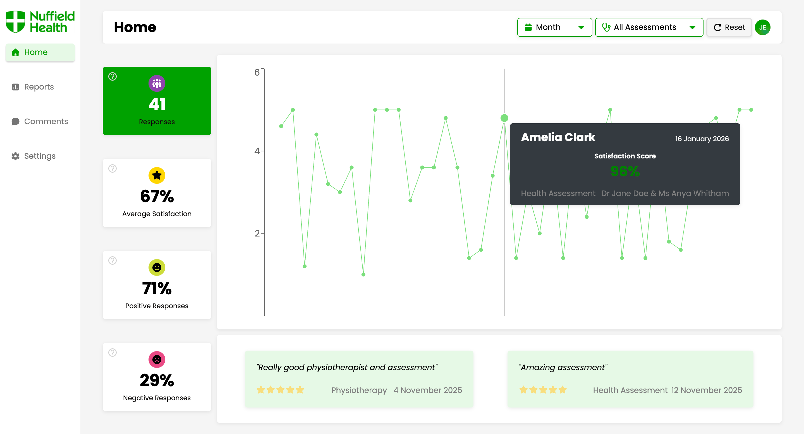
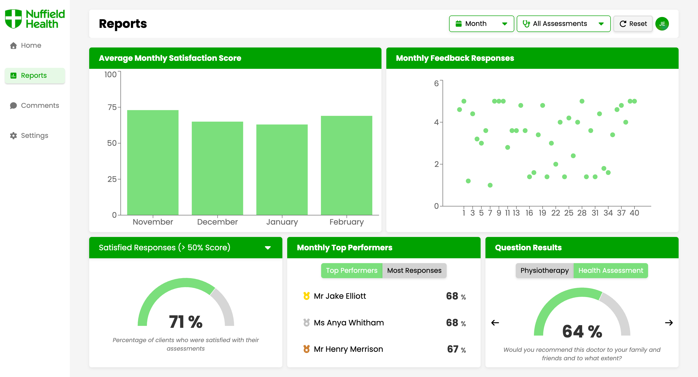

<h1 align="center">📊 Customer Feedback Form & Analytics Portal</h1>

    <a href="https://nh-feedbackportal.netlify.app/">🔗 Live Demo</a>

## 📖 About The Project

**A client feedback form and analytical portal to increase client engagement and provide useful site-specific insights.**

The project was a learning initiative at my current workplace aimed at increasing the current low engagement in feedback responses and furthering my knowledge of React and JavaScript.

The project consists of:
A QR-scannable feedback form for clients to complete after their assessment. It consists of clinician dropdowns, star rating questions and a comment section.
An authentication-protected analytical portal to help managers gain insights into their sites' data. The data is pulled from Supabase and displayed in graphs and tables. The portal also has filtering and sorting functionality to allow users to find patterns and monitor data over time.

To make the forms site-specific, all questions and clinicians are configurable through the portal settings page. 

## ✨ Features 

#### Live UI & Dataset

- Live data from Supabase displayed in tables and graphs for quick insights.

#### Configurable Forms

- Admins can add clinicians to the dropdown and modify questions for site-specific insights.

#### Authentication Protected

- Users can only view their site’s data; all feedback is secure.

#### Filtering & Sorting

- Filter by time period, clinician, or assessment type.
- Sort to quickly identify negative feedback and monitor trends.

## ⚙️ Built With

## 🧠 What I learned

* Handling live datasets, both from inputting data into a database and pulling data. This also provided me with a glimpse into SQL and its core basics.
* Using reducers. Previously, my practice projects all used states and props. Therefore, learning to use reducers gave me my first insight into state management and the pros and cons of different methods.
* Structuring projects. I used css modules for this project and tried to structure the project as close to a professional layout as I know. This gave me a better understanding on how to structure but also think about code and the bigger picture of each component. 

## 🚀 Usage

### 📱 Feedback Form

- Clients scan the QR codes present in the assessment rooms and reception.
- The form opens on any mobile device.
- Users select their clinicians, star ratings and leave comments.
- Users submit responses.

### 📊 Analytics Portal

- Site managers login through the authenticated portal.
- The dashboard displays all feedback or the site, from any date.
- Users can filter data based on month, assessment type or clinician.
- Users can identify trends, monitor client satisfaction or reach out to unhappy clients.
- The settings page allows users to modify the form.

## ⏭️ Next Steps

- Add monthly data trends. Upon signing in, users can see how this month compares to the previous month.
- Add exporting functionality. Allowing users to export clinicians specific responses as doctors frequently need client feedback for appraisals.
